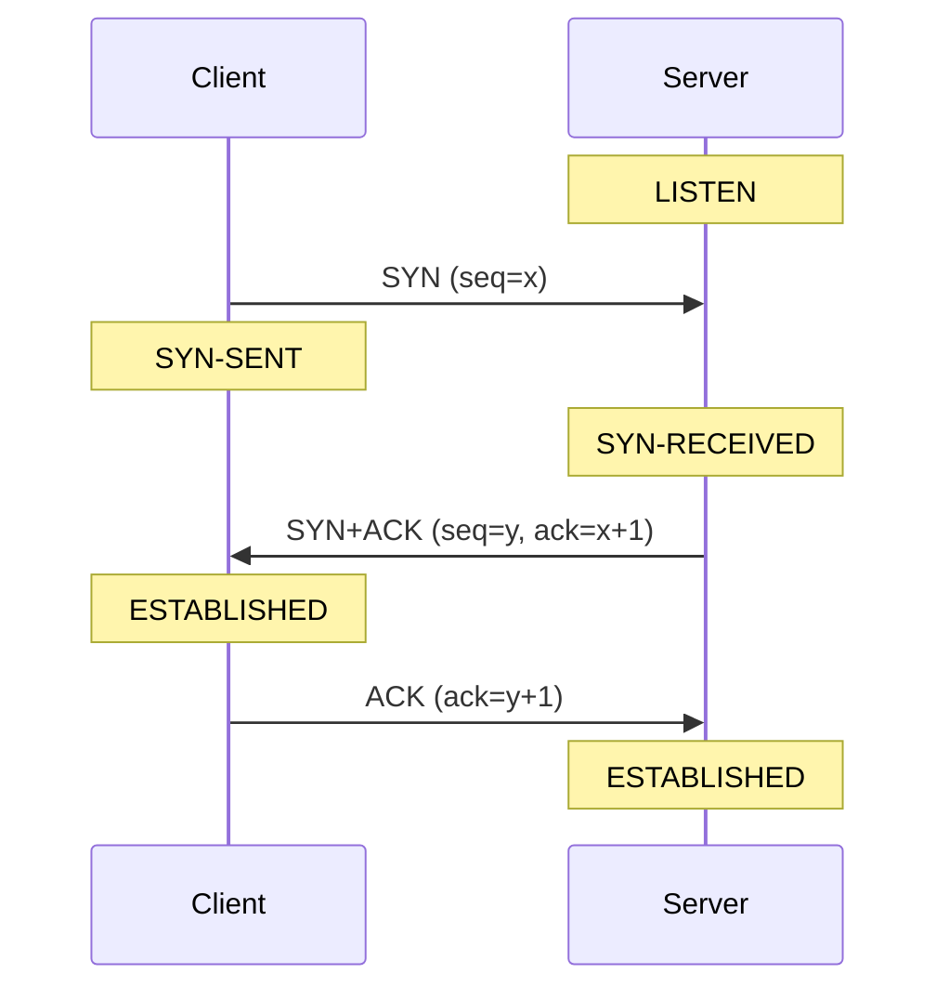

:::note[예시 노트]
노트 형식을 보여주려고 만든 예시다. "한 줄 요약"과 "처음 가졌던 질문"은 원래 공부한 사람이 자기 말로 쓰는 자리다.
:::

## 한 줄 요약

양쪽이 서로의 시작 시퀀스 번호(ISN)를 **받았다고 확인**해야 연결이 성립하니까, 최소 세 번은 오가야 한다.

## 처음 가졌던 질문

"보내도 돼?" → "응" 두 번이면 충분하지 않나? 왜 굳이 세 번일까?

## 핵심 개념



- **SYN (seq=x)**: 클라이언트가 자기 ISN `x`를 알린다.
- **SYN+ACK (seq=y, ack=x+1)**: 서버가 `x`를 받았다고 확인하면서, 자기 ISN `y`를 알린다.
- **ACK (ack=y+1)**: 클라이언트가 `y`를 받았다고 확인한다.
- SYN 플래그는 시퀀스 번호를 **1 소비**한다. 그래서 응답이 `x`가 아니라 `x+1`이다.
- 클라이언트는 SYN+ACK를 받는 순간 ESTABLISHED가 되고(그래서 마지막 ACK에 데이터를 실어 보낼 수도 있다), 서버는 마지막 ACK를 받아야 ESTABLISHED가 된다.

**왜 두 번으로는 안 될까?**
두 번이면 서버는 자기가 보낸 `y`가 클라이언트에 닿았는지 알 수 없다. 또 네트워크에 떠돌던 **오래된 중복 SYN**이 뒤늦게 도착하면, 서버는 그걸 새 연결 요청으로 착각해 연결을 열어버릴 수 있다. 세 단계로 하면 클라이언트가 예상하지 못한 SYN+ACK를 받았을 때 "그건 내가 지금 요청한 게 아니다"라고 거절(RST)할 기회가 생긴다. RFC가 꼽는 3-way handshake의 핵심 이유가 바로 이것이다.

## 직접 해보기

터미널 세 개에서 차례로 실행한다 (macOS 기준, 루프백 인터페이스는 `lo0`. 리눅스는 `lo`):

```bash
python3 -m http.server 8080
```

```bash
sudo tcpdump -i lo0 -n 'tcp port 8080'
```

```bash
curl -s localhost:8080 > /dev/null
```

tcpdump 출력의 플래그로 세 단계를 볼 수 있다:

| tcpdump 플래그 | 의미 |
| --- | --- |
| `[S]` | SYN |
| `[S.]` | SYN + ACK (`.` = ACK) |
| `[.]` | ACK |

## 헷갈렸던 포인트

- **ISN은 0부터 시작하지 않는다.** 예측 가능하면 공격자가 연결에 끼어들 수 있고, 이전 연결의 패킷과 섞일 수도 있다. 그래서 RFC 6528은 시간에 따라 증가하는 값에 연결마다 다른 비밀 해시 값을 더해, 밖에서 추측하기 어렵게 정하도록 권한다.
- **3-way는 연결을 열 때, 4-way는 닫을 때.** 닫을 때는 양쪽 방향을 따로 닫을 수 있어서(half-close) FIN/ACK가 방향마다 한 쌍씩 필요하다. 다만 한쪽의 ACK와 FIN이 한 세그먼트에 합쳐지면 3번에 끝나기도 한다.

## 복습 퀴즈

<details>
<summary>Q1. 서버가 SYN+ACK에 ack=x가 아니라 ack=x+1을 넣는 이유는?</summary>

SYN이 시퀀스 번호를 1 소비하기 때문이다. ACK 번호는 "다음에 받기를 기대하는 시퀀스 번호"라서 `x+1`이 된다.

</details>

<details>
<summary>Q2. 2-way handshake면 생기는 문제 두 가지는?</summary>

1. 서버의 ISN이 클라이언트에 전달됐는지 확인할 수 없다.
2. 지연된 오래된 SYN 때문에 원치 않는 연결이 열릴 수 있다.

</details>

<details>
<summary>Q3. 서버가 SYN을 받은 직후 들어가는 상태는?</summary>

`SYN-RECEIVED`. 마지막 ACK를 받으면 `ESTABLISHED`가 된다.

</details>

## 관련 개념

- TCP 4-way handshake (작성 예정)
- SYN flood와 SYN cookie (작성 예정)

## 참고 자료

- [RFC 9293 — Transmission Control Protocol (TCP)](https://www.rfc-editor.org/rfc/rfc9293), 3.5절 연결 수립
- [RFC 6528 — Defending against Sequence Number Attacks](https://www.rfc-editor.org/rfc/rfc6528)
